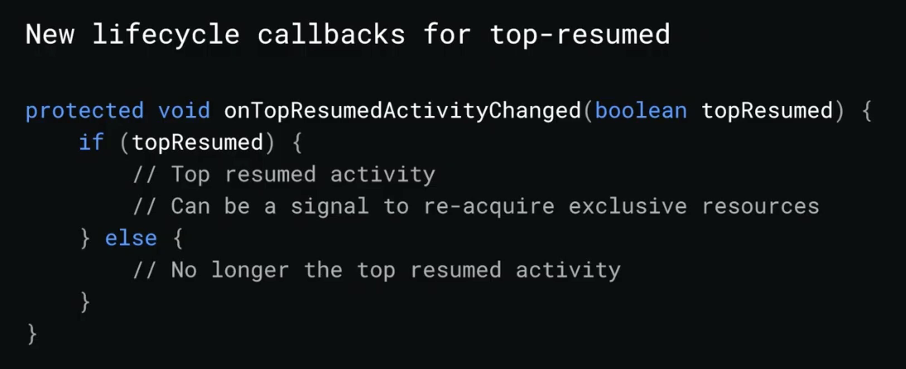

# Building Apps for Foldable  

Android supports foldable  

- folding と unfolding の切り替えは restore される   
- `android:resizeableActivity` の設定で orientation の変更と folding 切り替えは無効にできない  

### Multi-resume
multi-window で表にあるものは全て resume になる  
ただし、camera は複数起動できない  

  

### Drag-n-drop  

Multi-window で text と image の Drag and drop が可能に  

### Configuration changes  

### Multiple instances  

`FLAG_ACTIVITY_NEWS_TASK|FLAG_ACTIVITY_MULTIPLE_TASK`

### Wallpapers support secondary screen  

```
<wallpaper  
  android:supportMultipleDisplays="true" />
```

### Test  
Force desktop mode from developer option  


[Guide](https://developer.android.com/preview/features/foldables)  
