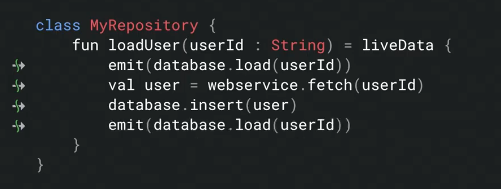

# Understanding Coroutines On Android  
https://youtu.be/RLEQ3PAor1g?t=15555  

[リファレンス](https://developer.android.com/topic/libraries/architecture/coroutines#livedata)  

## WorkManager  

- CoroutineWorker   


- Retrofit 2.5.1 で suspend 使える  

## LiveData  

- LiveData 2.2.0-alpha01  
```
val user = liveData(Dispatchers.IO) {
    emit(database.load(userId))
}
```
```
fun createTimer() :LiveData<Long> {
    val start = now()
    return liveData {
        while(true) {
            emit(now() - start)
            delay(1_000)
        }
    }
}
```



### Leak  


↓


```
fun onCreate() {
    lifecycleScope.launch {
        val note = userVM.loadNote()
        updateUI(note)
    }
}

fun onCreate() {
    lifecycleScope.launchWhenStarted {
        val note = userVM.loadNote()
        fragmentManger.beginTransaction().commit()
    }
}
```

### Test  

- Use `TestCoroutineDispatcher`

```  
val testDispatcher = TestCoroutineDispatcher()
val testScope = TestCoroutineScope(testDispatcher)

@Before
fun setup() {
    Dispatchers.setMain(testDispatcher)
}

@After
fun teatDown() {
    Dispatchers.resetMain()
    testScope.cleanupTestCoroutines()
}

@get:Rule
val testCoroutineRule = TestCoroutineRule()

@Test
fun testLiveData() = testCoroutineRule.runBlockingTest {
    // call suspend fun
}
```

- LiveData のテスト  


### coroutines first    


