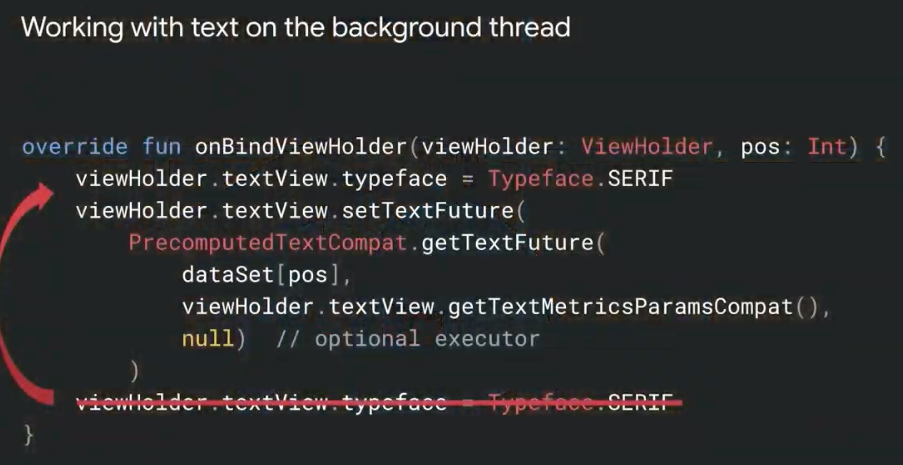
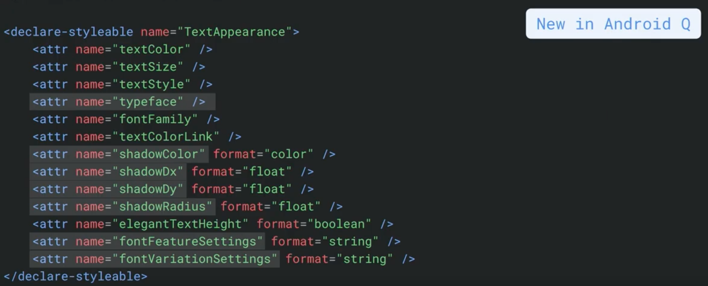
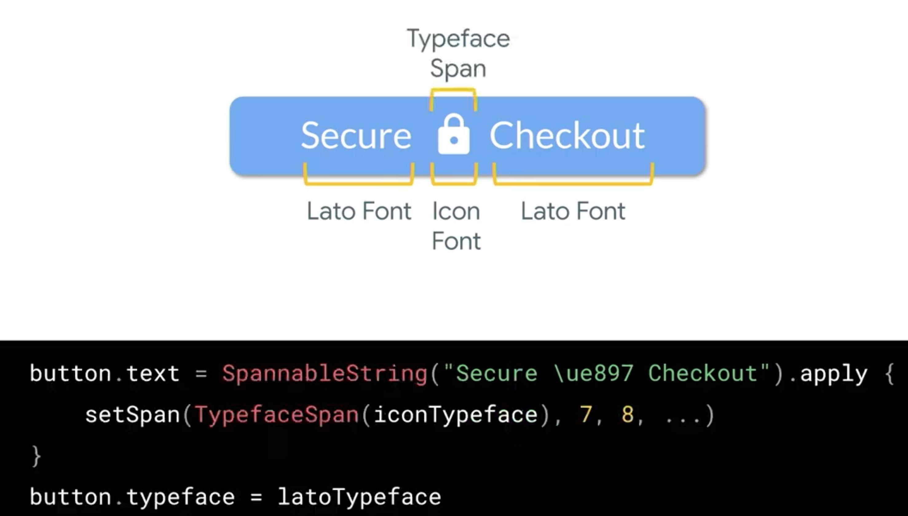
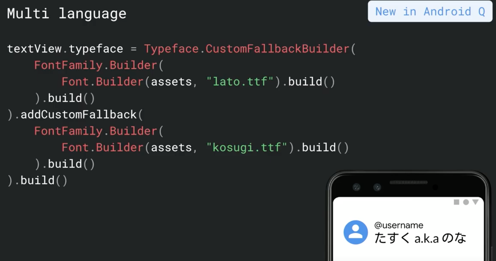
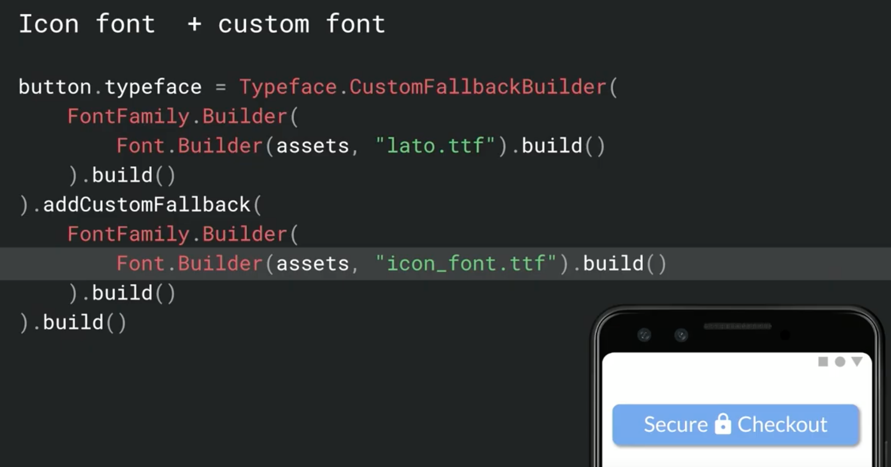
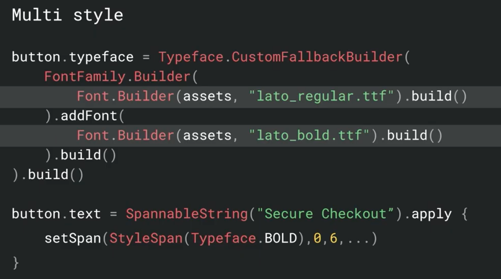
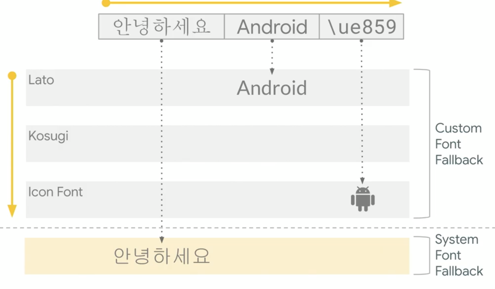
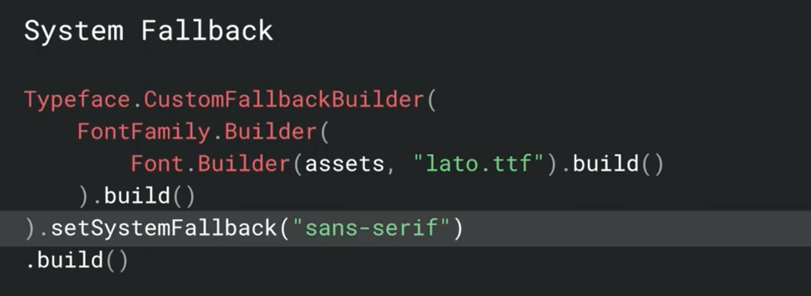
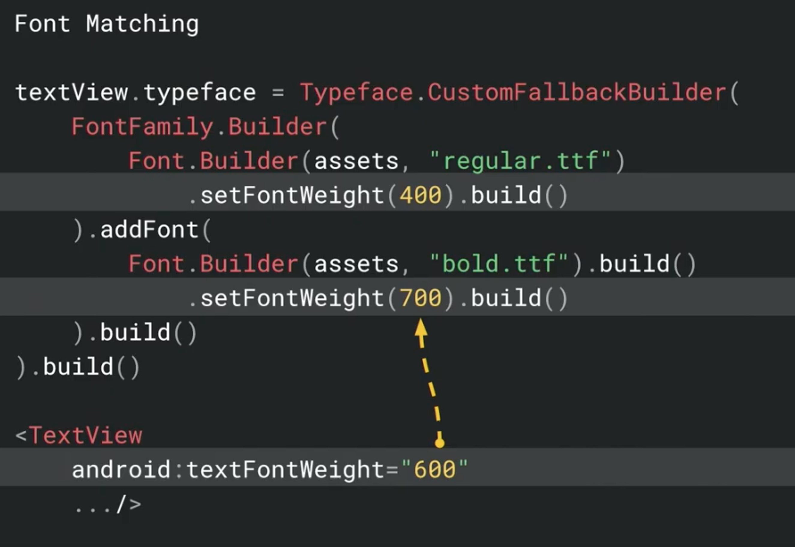
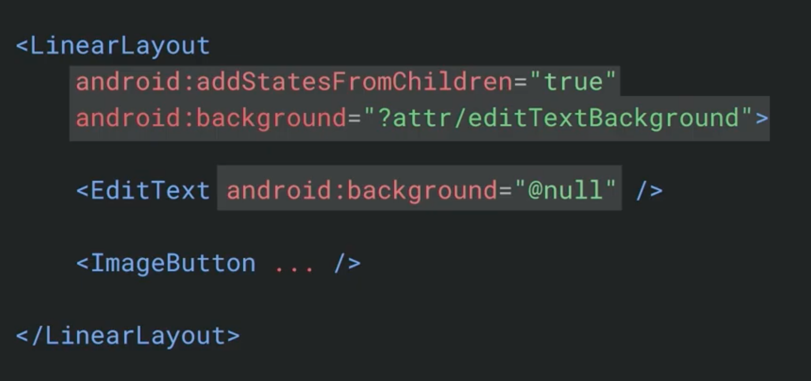

# Best Practices for Using Text in Android  

### Precomputed Text  

- Text のスタイルは Precomputed の後に変更したらエラーになる  


### Styling Text  

- Android Q より TextAppearance パラメータが追加される  
  

### Custom Fonts  

  
効率的ではない  

- Android Q より `Typeface.CustomFallbackBuilder` が追加    
  
  

- 複数の Style も可能  
  

- `CustomFallbackBuilder` では最大 64 のフォントまで使える  

- サポートしているフォントから使われ、最終的にはシステムフォントになる  
  

- その場合のシステムフォントのスタイルも定義可能  
  

- フォントの Weight もセットできる  
  

### Editable Text  

- EditText + Image  
  

- TextInputLayout の Helper Text の下にキーボードになるのは Rect 周りをいじっているため  

- キーボードにパスワードを覚えさせないようにできる  
```
android:imeOptions="flagNoPersonalizedLearning"
```
