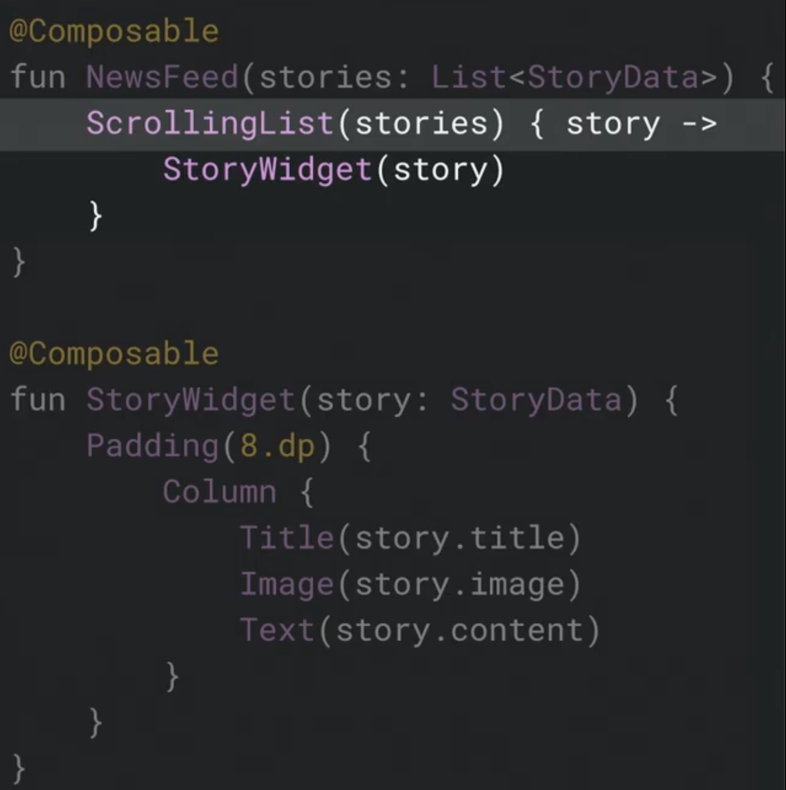
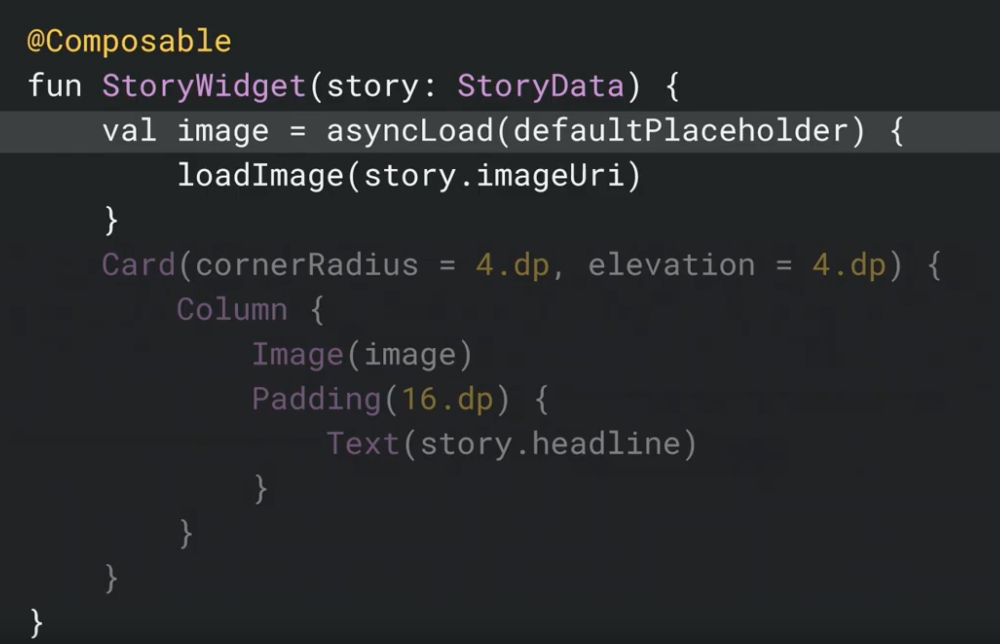
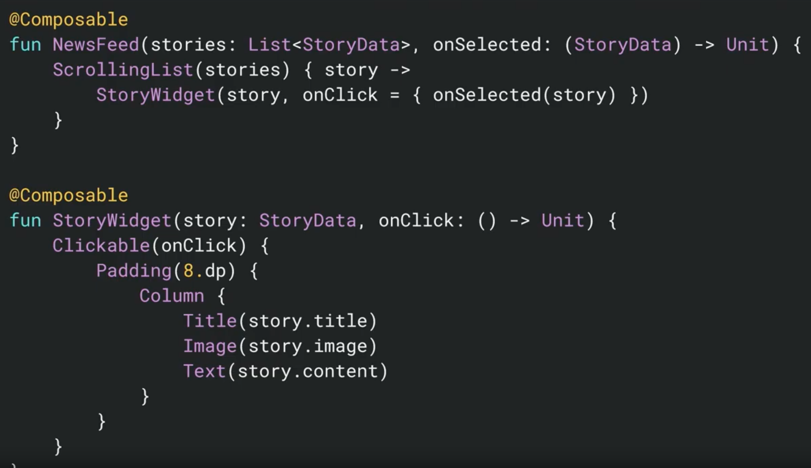
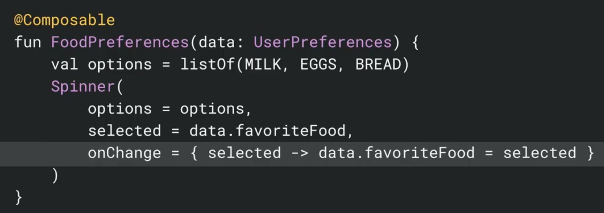
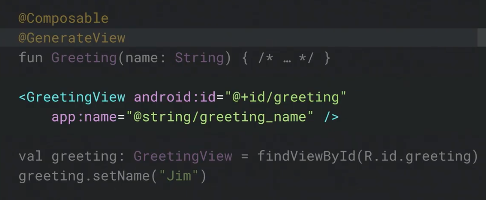

# Declarative UI Patterns  

https://youtu.be/irpNzosHbPU

- 既存の View が負債を抱えているため、その改善として Jetpack Compose  
View のコードの肥大、Spin しない Spinner 、TextView を extend した Button  

### Jetpack Compose

```
@Composable
fun Greeting(name: String) {
    Text("Hello $name")
}
```

- Compose が `@GenerateView` で通常の View を作れる

- List 表示  


- 画像の非同期表示  


- `@Model` の data class を使うことで mutable な項目を更新する?

- onClick Event  


- dataChanged  


- Compose から View の生成  

