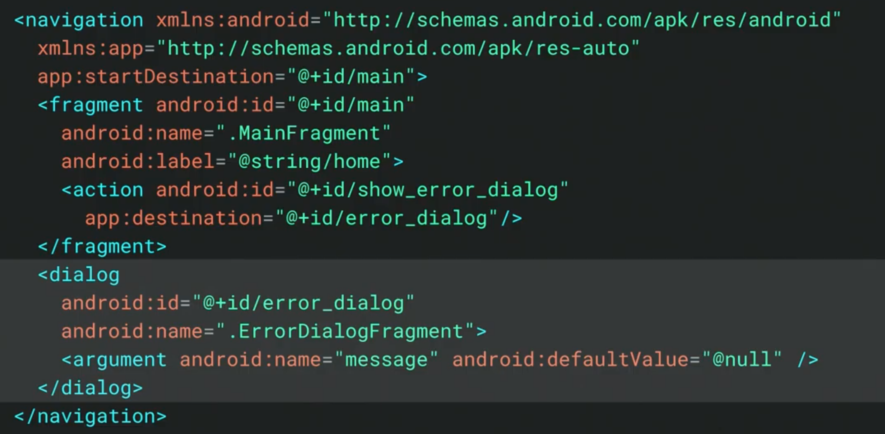
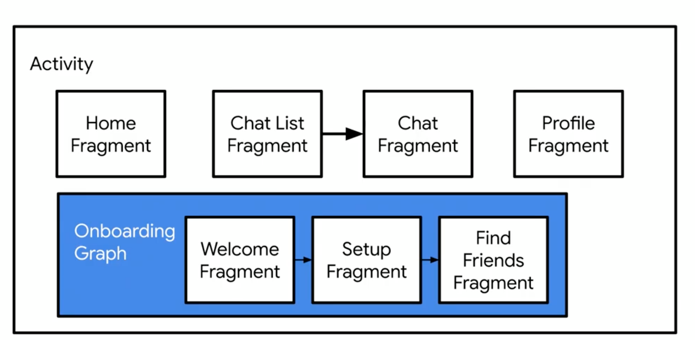
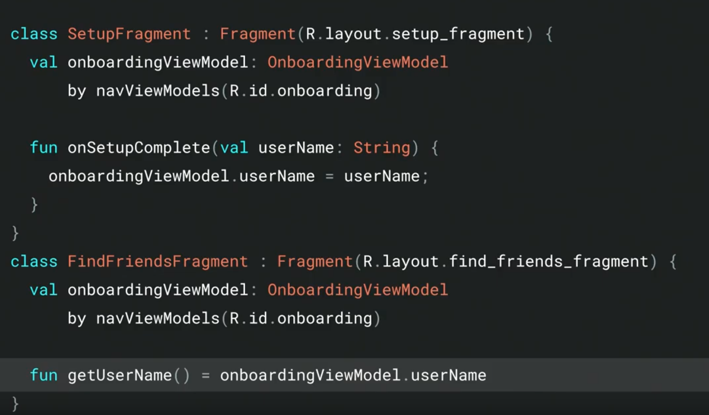
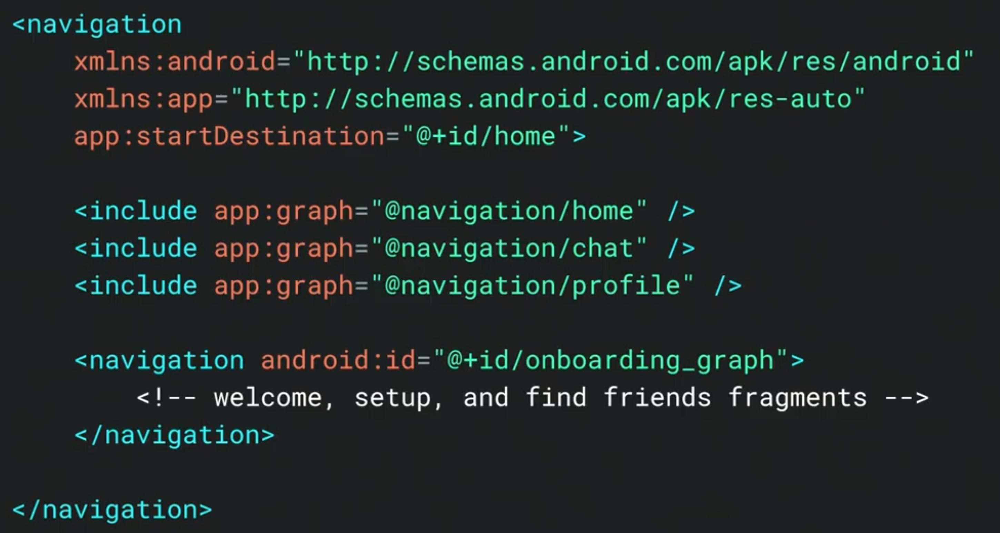
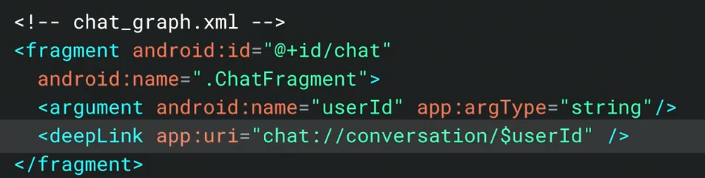

# Jetpack Navigation  

### Dialog Destination  
- New in navigation 2.1.0  
- Use <dialog> navigate to DialogFragment  

### ViewModels in Navigation  
- New in navigation 2.1.0  
- ViewModels scoped to a navigation graph  
- 複数の Fragment で ViewModel の共有  

### SafeArgs  
- Parcelable や Serializable のクラス名渡せる  

### Multi Module  
- app の navigation に include でモジュールにある navigation を持ってくる  

### Navigating bu URI  

### Dynamic Feature Navigator  
- DFM で Navigator を使えるようになる何か  
- Comming later this year  
