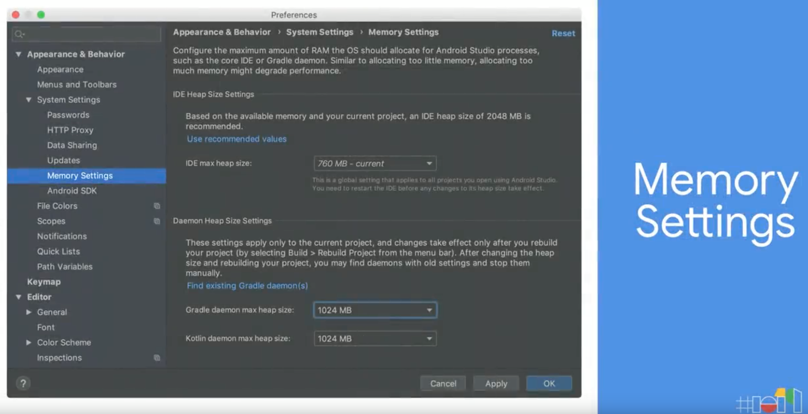

# What's New in Android Development Tools  

- [Youtube](https://youtu.be/8rfvfojtRss)  
- [Article](https://android-developers.googleblog.com/2019/05/android-studio-35-beta.html)  

### Project Marble  

- UI のフリーズを改善  

- HeapSize を変更できるようにして OutOfMemory の改善  

- 使用していない Plugin をチェックして CPU や速度改善  

- Emulator CPU Usage の改善    

- Apply Changes  
Instant Run の後継  

- Layout Editor、Build Output Window の修正、サイズを小さくするのは今後のリリースで  

### Layout Inspector  

- Xcode みたく 3D 表示可能  

- Layout Inspector の Attributes からレイアウトのリソースへ飛ぶことができる  

### Resource Manager   
- Resource Manager からレイアウトへドラッグ&ドロップで ImageView に src がセットされた状態で表示できる  

### MotionLayout  

### AS が Chrome OS でもサポート  

