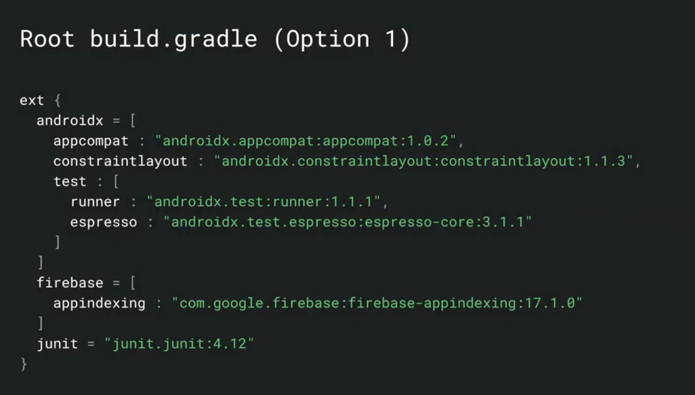
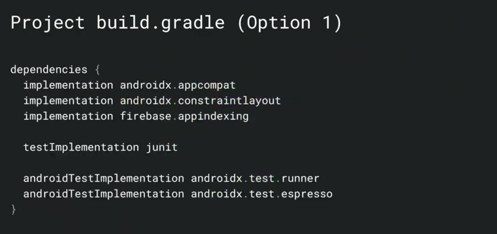
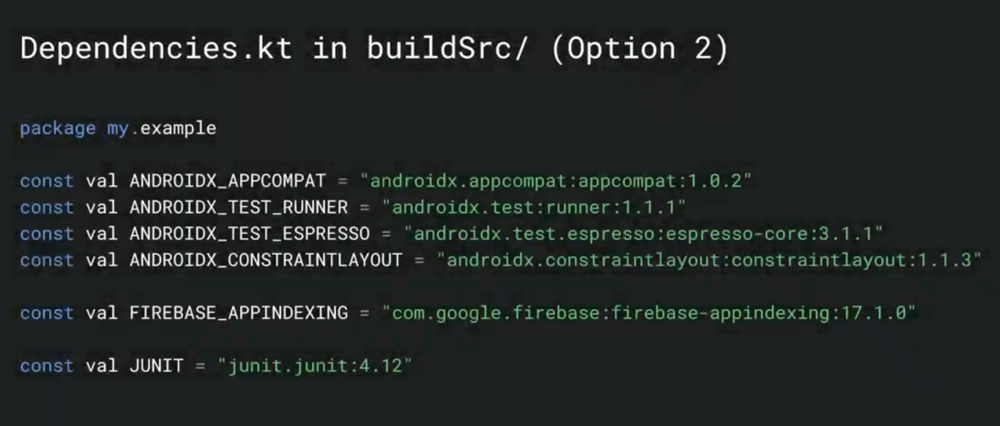
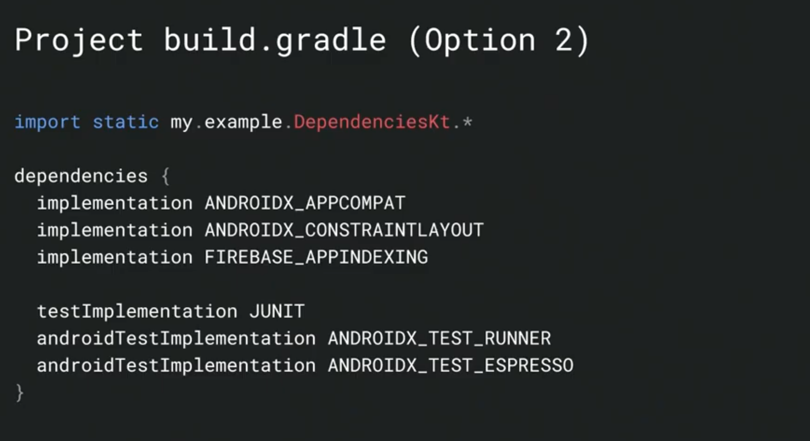
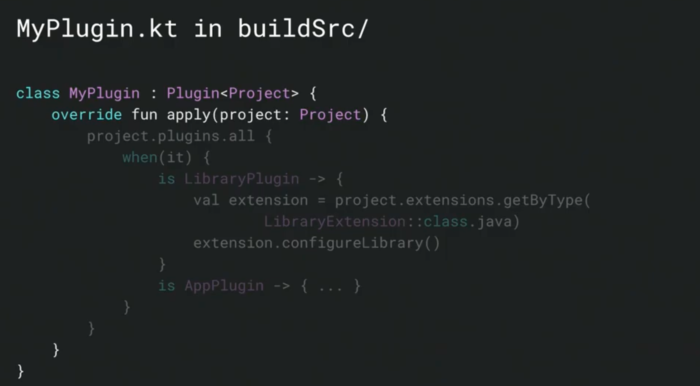
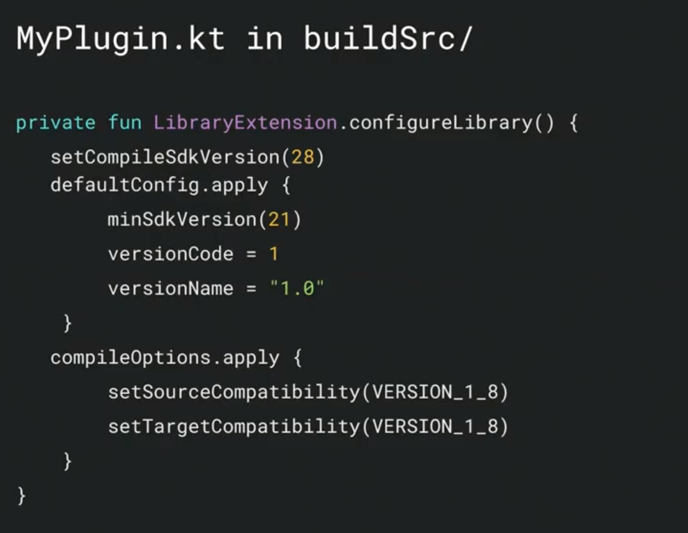
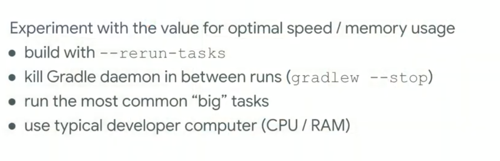

# Build Bigger, Better:

### Modularize  

- キャッシュ、並列実行によるビルドの高速化  
- モジュール単位のテスト  
- Lint をモジュール単位で実行  

### dependencies の DRY  

- ライブラリの管理 パターン1  
  
  

- ライブラリの管理 パターン2  
  
  

- Config の管理 DSL  
  
  

### Build Scans  

- `./gradlew task --scan` で　Gradle のサーバにビルドの情報を送る  

### Gradle Memory Limits  

- 計測してどのくらい必要か確認する(ex. -Xms2g)   
  

- Gradle build scan で Execution と garbage collection の時間を比較  

- `org.gradle.workers.max` で worker の設定ができる  
