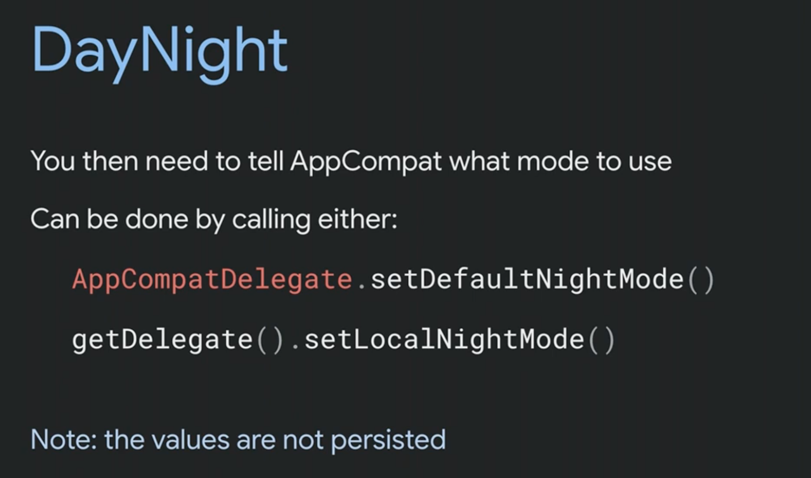
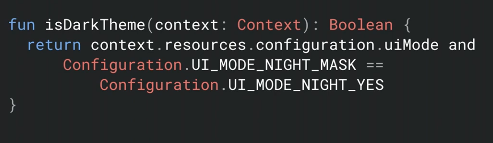
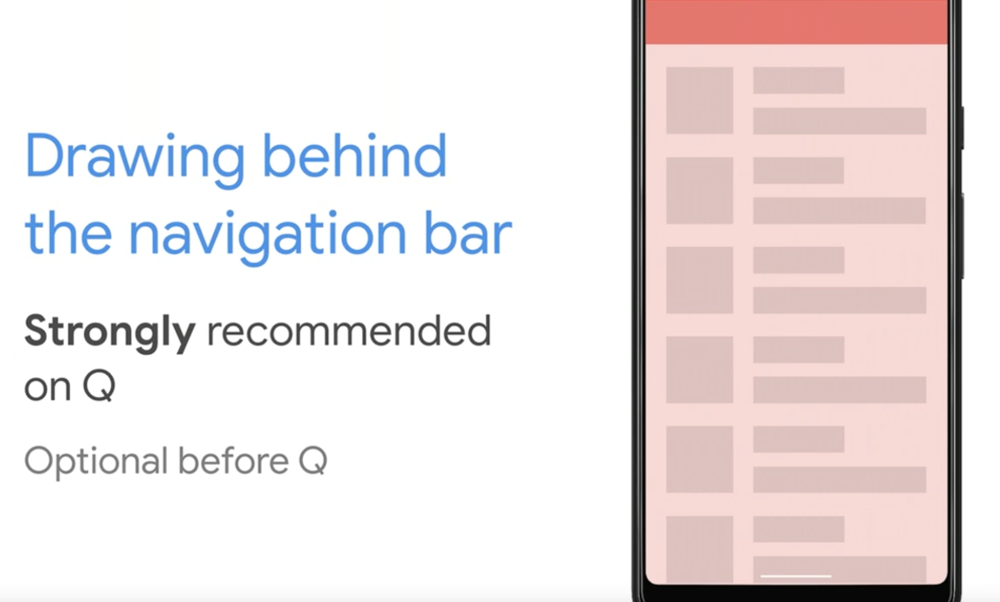
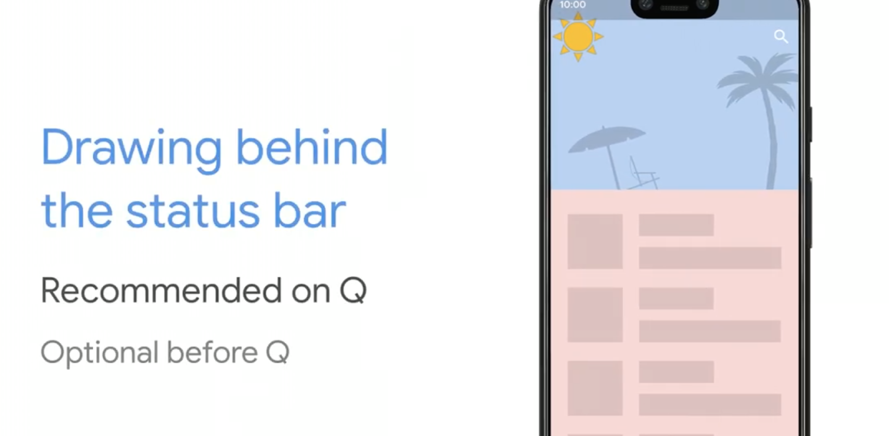
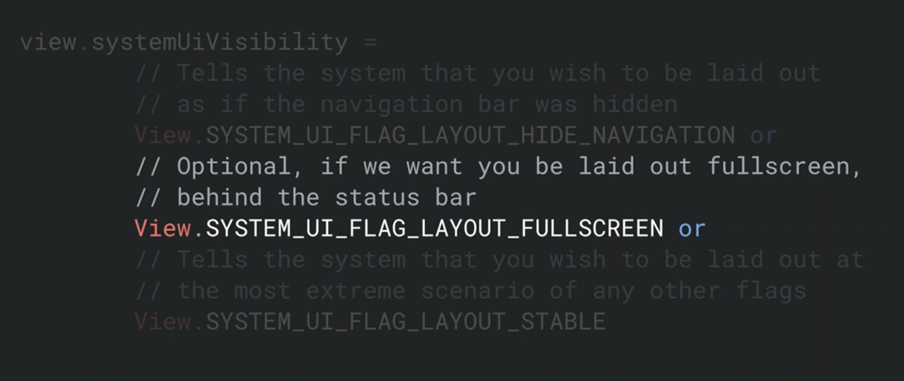
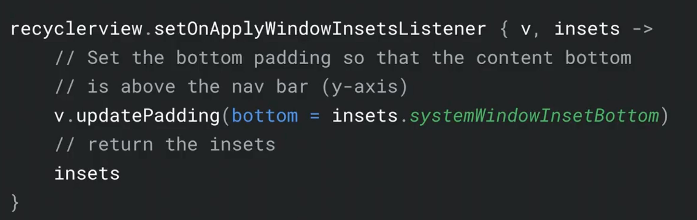
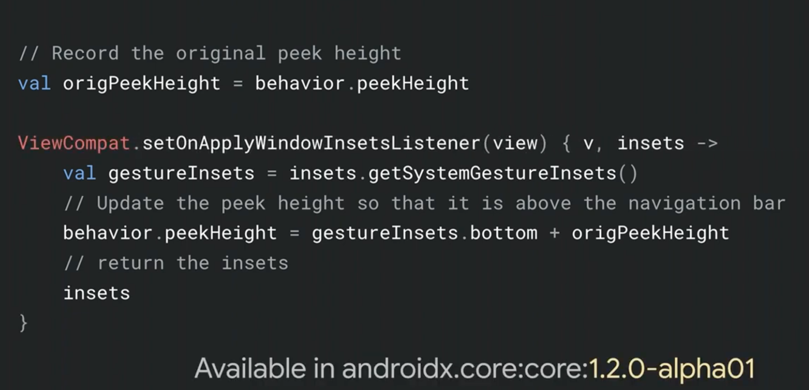
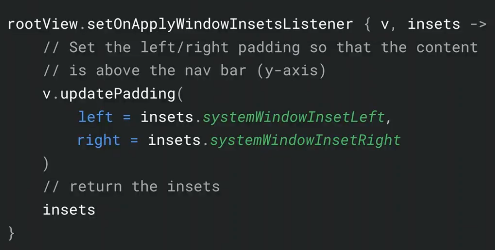

# Supporting mobile usability with Dark Theme and Gestures in Android Q

- [Youtube](https://youtu.be/OCHEjeLC_UY)

### DarkTheme  

- バッテリーの節約とアクセシビィリティ  

- Android Q で System theme の設定が可能に  

- アプリでの DarkTheme の実装は強く推奨される  

- Light、Dark、System を選択させる方がいい  

### Force Dark  

- Automatically convert app to dark theme  
Style に `<item name="android:forceDarkAllowed">true</item>`   

- View に対して `android:forceDarkAllowed="false"` で個別に無効にできる  

- 開発者向けオプションで強制的に Dark Theme の適用ができる    

### Day Night  

- `-night` のリソースを使用  

- Implements  
   

- Mode が 4 つある  
AppCompat 1.1.0 から `MODE_NIGHT_AUTO_BATTERY` が追加  

- `setDefaultNightMode()` が呼ばれると recreate する  

### Elevation  

- Dark Theme では shadow を変えると surface も変わる  

### Theming  

- Secondary Variant は DarkTheme では使わないぽい  

- Check Dark Theme  
     

### WebView

- WebView も ForceDarkTheme 可能  

- CustomTabs は Soon  
`setColorScheme` のオプションで可能  

### Map  

- mapStyle から -night の 'map_style.json' をダウンロードできる  

### Image Res  

- DarkTheme 用に画像のリソースを用意する or vector で tint を使う  

### Notification  

- 自動的に適用されるが、カスタムレイアウトを使用している場合は適用されない  


### Gesture Navigation  

- Q Beta 3 から Navigation が変わった  
- 3 ボタン or ジェスチャー  
- 他のジェスチャー(Drawer、BottomSheet)と競合しないように気をつける必要がある

### edge-to-edge  

- Q 以降は NavigationBar と statusBar の下にもコンテンツを表示させる  
  


### Implements edge-to-edge  

- `values-v29/theme`  

```
<item name="android:navigationBarColor">@android:color/transparent</item>
```


### Insets  

- Use to move clickable views away from edges

- Use to move draggable views away from edges

### Override gesture  

- conflict back zone の時に対応できる API が Q から  
```
View.setSystemGestureExclusionRects(List<Rect>)
// CustomView は onDraw に追加する
```

- ScrollingView は clipToPadding と下を組み合わせる  
  

- BottomSheet の場合の対応  
  

- Carousels(ViewPagers) は対応しなくていい?   

- LandScape  
  

- 他にも Jetpack でサポートされる  
