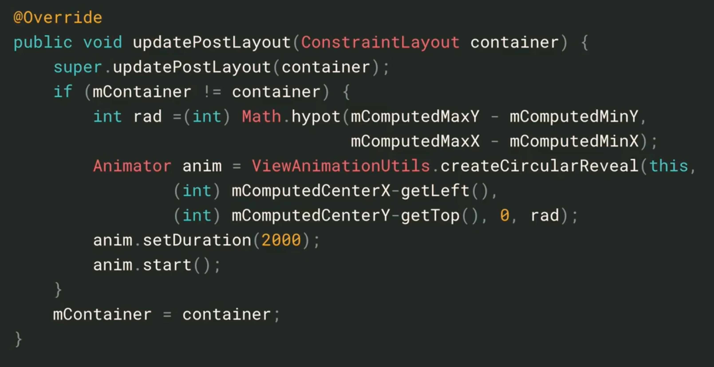
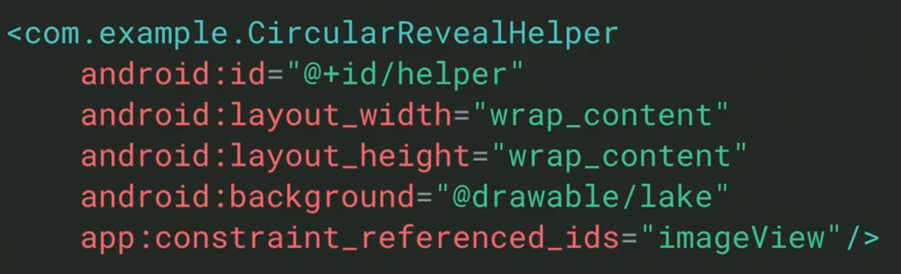
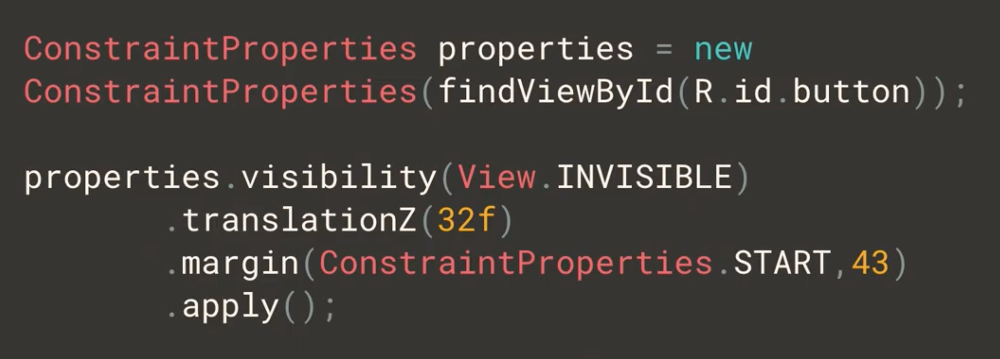
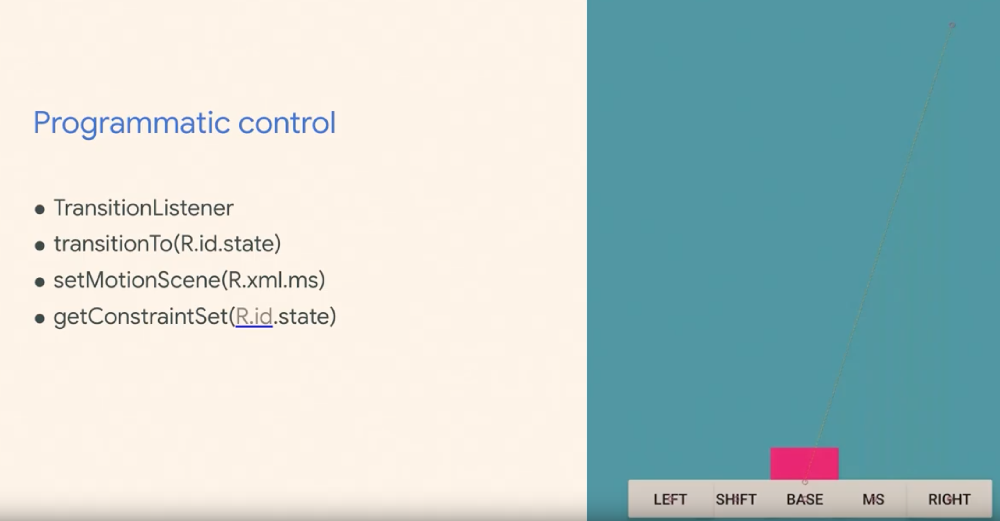
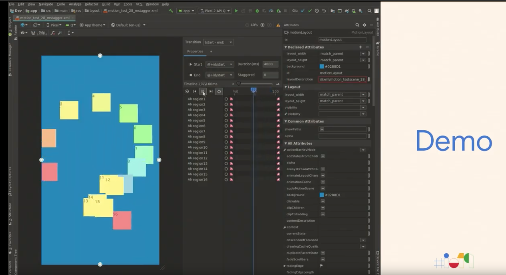
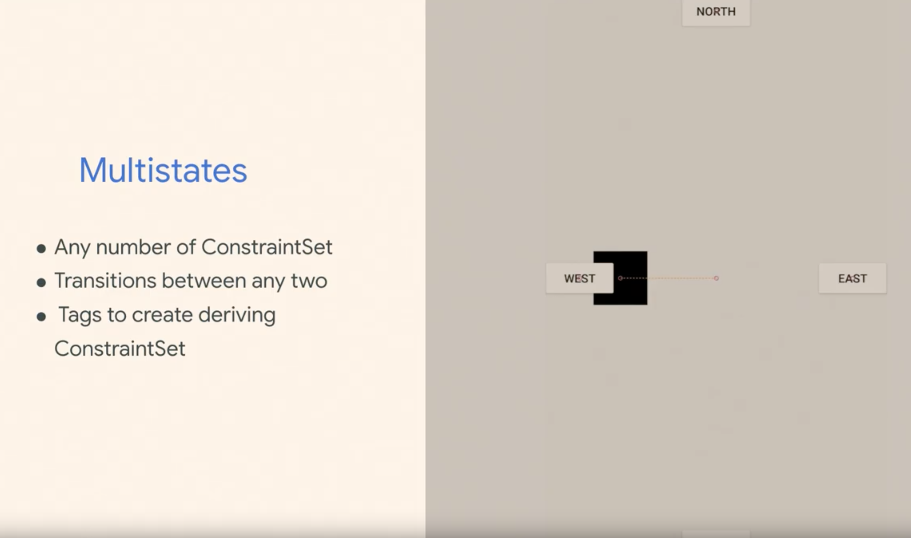
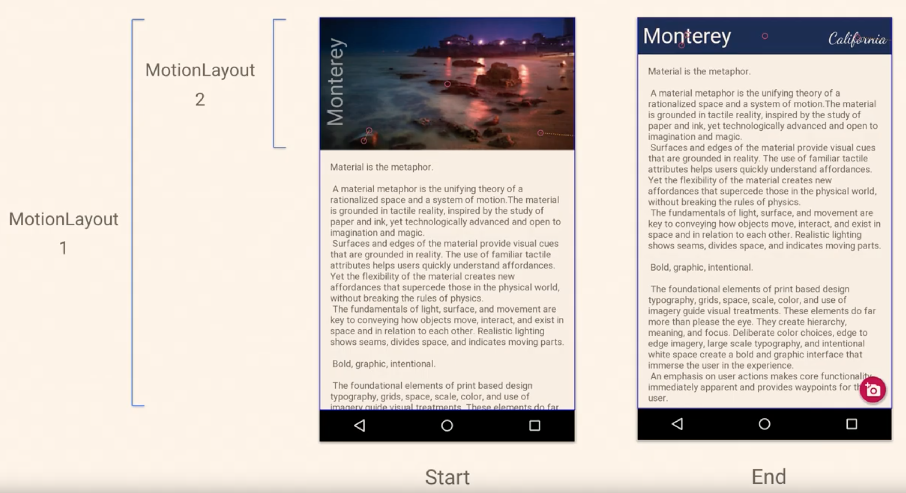
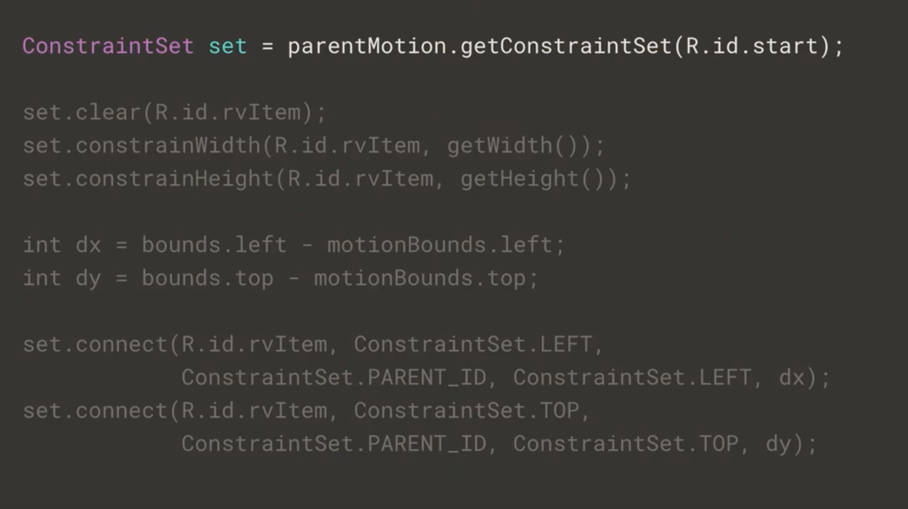
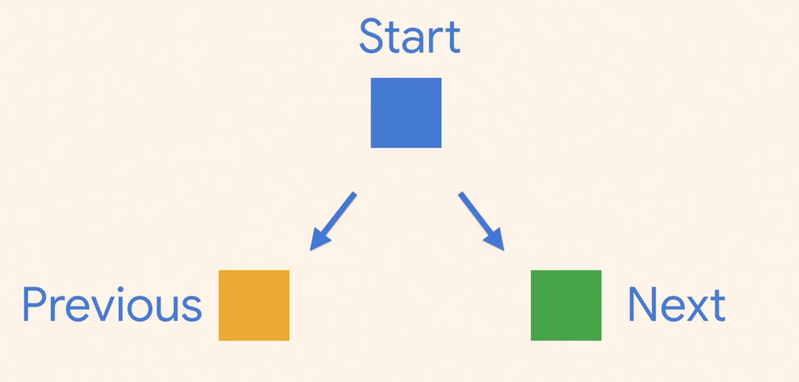
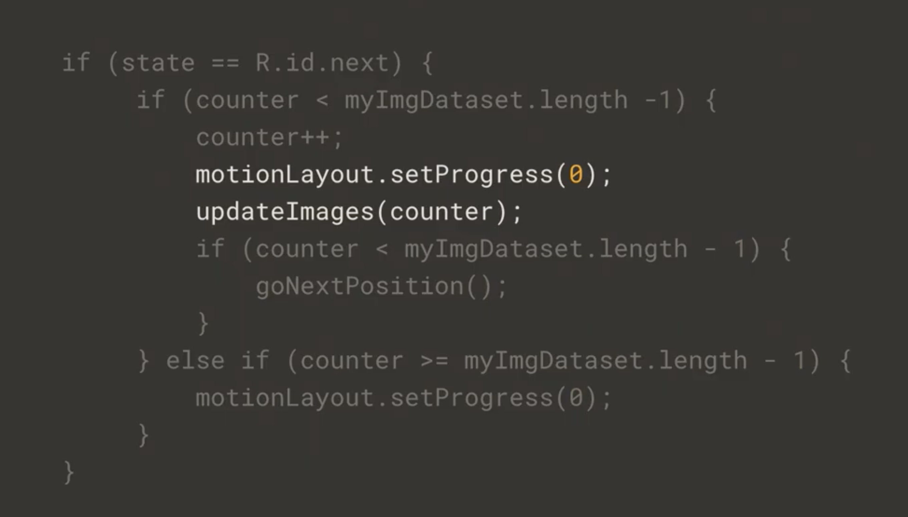

# What's new in ConstraintLayout  

### ConstraintLayout 2.x

- Flexibility (Virtual Layouts)
- Optimizer  
- MotionLayout  

- Beta1 リリース

### Circular Reveal

  

  

### Flow    

- 自動で改行をしてくれる  
Flexbox に近いもの  

- [以前のリリースノート](https://androidstudio.googleblog.com/2019/04/constraintlayout-200-alpha-5.html)  
- [Makers のプレゼン](https://speakerdeck.com/camaelon/constraintlayout-2-dot-0)  

### ConstraintSet

- 書き方が変わった
  

### MotionLayout  

- コード上でアニメーションを動的に変えることができる  
  

- Flow と組み合わせることも可能  

- Motion Layout Editor  

- Layout Editor で ConstraintLayout から MotionLayout へのコンバートが可能  

- Multistates  

- Nested MotionLayout  

- RecyclerView + MotionLayout  

### MotionLayout List  

- 前と後ろのモーションを用意  

- スワイプしたらポジションを戻してリストの中身だけ横にずらす  

