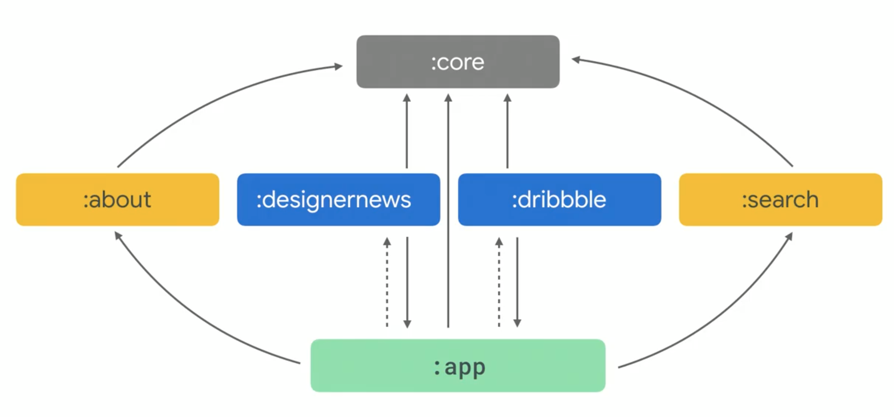
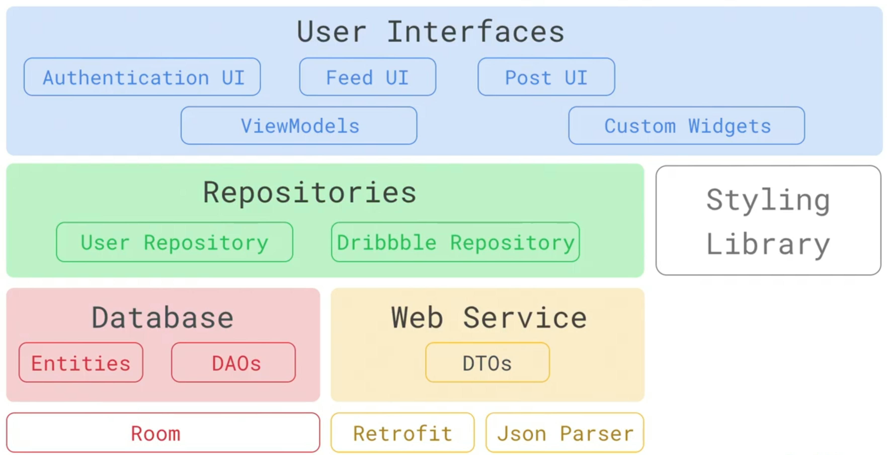
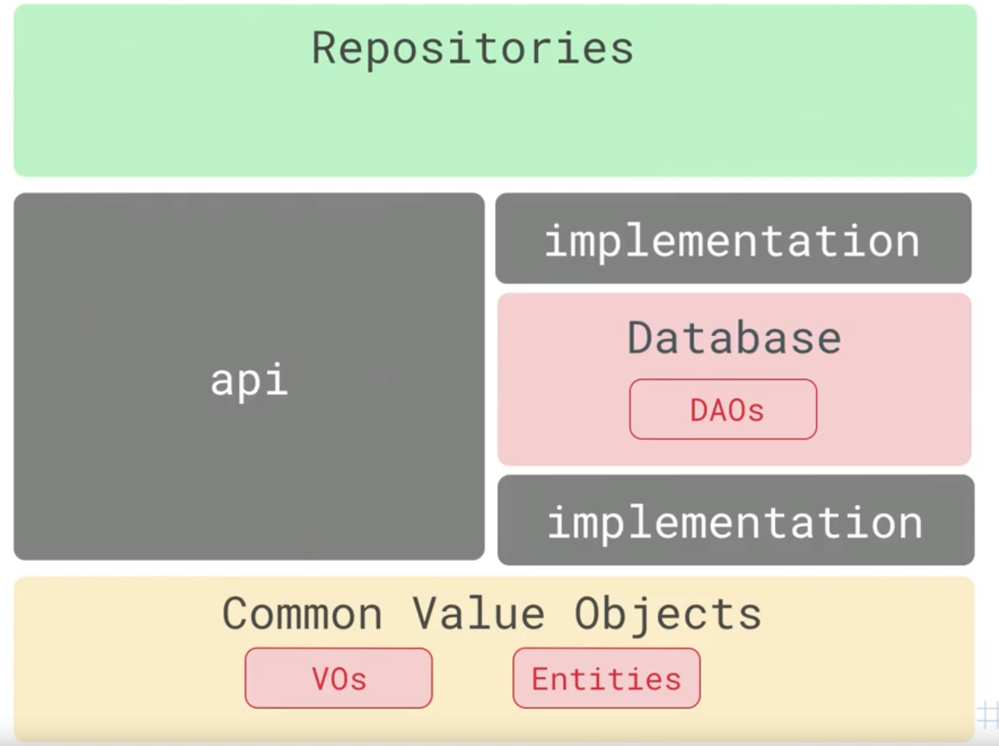

# 3. How to create a modular Android app architecture  

https://youtu.be/RLEQ3PAor1g?t=363

- faster compile  

### Feature module  

### Layer module  

UI で Entity を使いたければ Databse ↔︎ Repository は api  

ただ、UI で Entity を知ってるのはおかしいので Model class のモジュールを追加する    

### Feature and Layer  

module 間で package を参照できない  
ex. `Intent(this, HogeActivity::class.java)`

↓

`Intent(Intent.ACTION_VIEW).setClassName(PACKAGE_NAME, "$PACKAGE_NAME.about.ui.AboutActivity")`

### Multi-module databases  
with Room  

### Free module  

Multi-platform でコードを共有したいとき  
