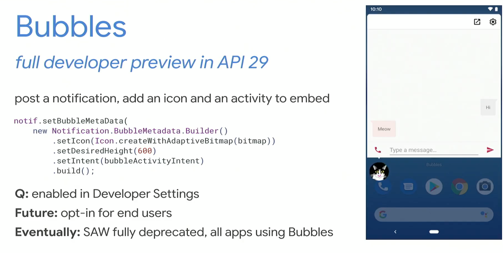
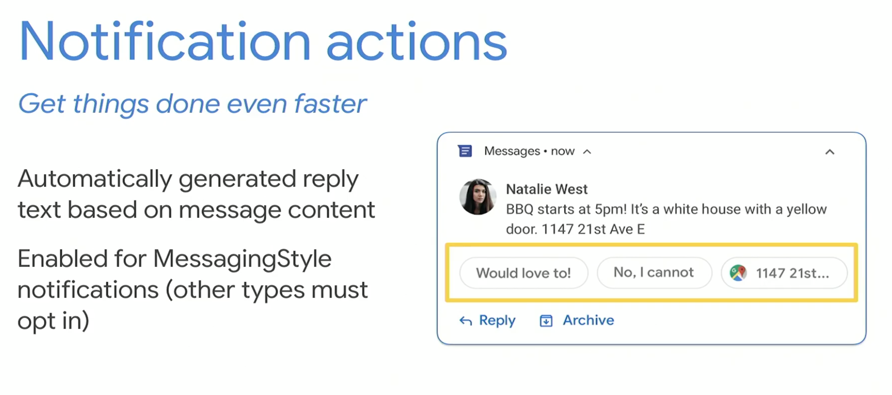
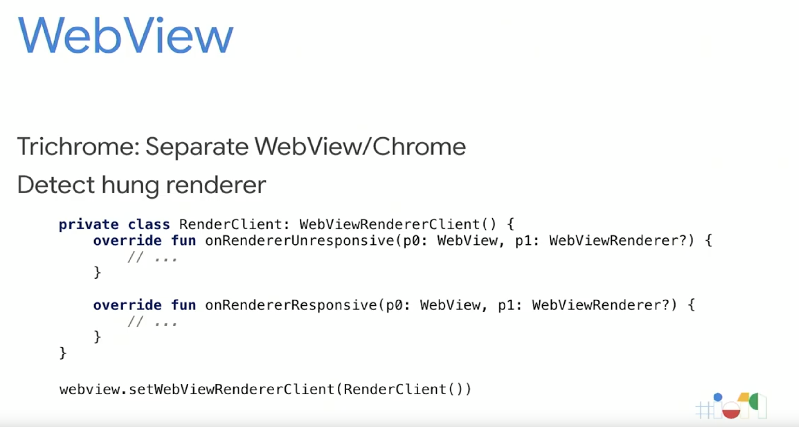
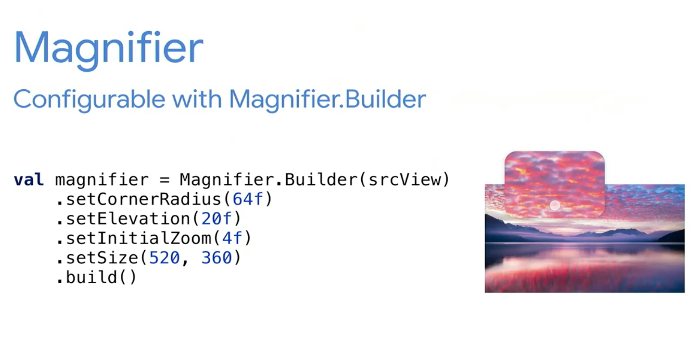
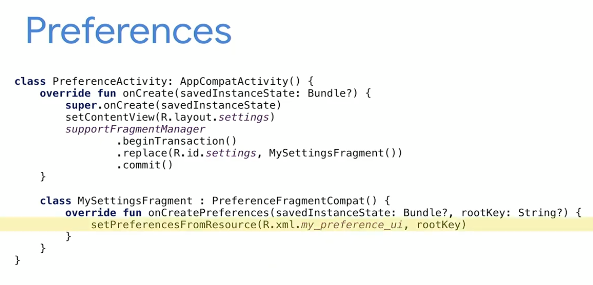
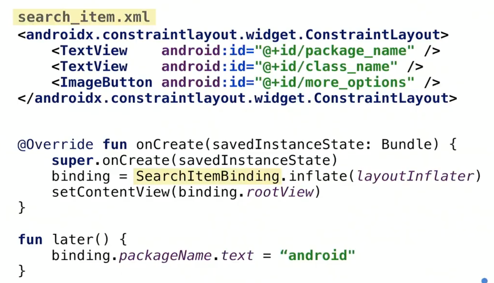

# 1. What's New in Android

https://youtu.be/l1e1gHhci70

### Bubbles  

### Dark Theme in Q

`MODE_NIGHT_AUTO_TIME` は Deprecated   

- Option A : Use theme
`Theme.AppCompat.DayNight`
- Option B : Manifest and view
`forceDarkAllowed`  
- Option C : -night resource  

### Q Share Sheet

### Notification  

IMPORTANCE_HIGH をいつでも使うな   

- Notification Actions    

### WebView  

### Text  

Hyphenation が API 23 で Default が On だったが Q で Off に  

LineBackgroundSpan と LineHeightSpan

### Magnifier  

  

### ART  

GC 周りの改善  

### Kotlin

Q の新しい API には Nullable の Annotation  

### Preference  
android.preference が Deprecated   

  

### CameraX  

Easy to use camera API  

### ViewBindings  

No more findViewById  
Generate form xml files.  

  

### External Storage  

tergetSDK Q 以上のみ  
